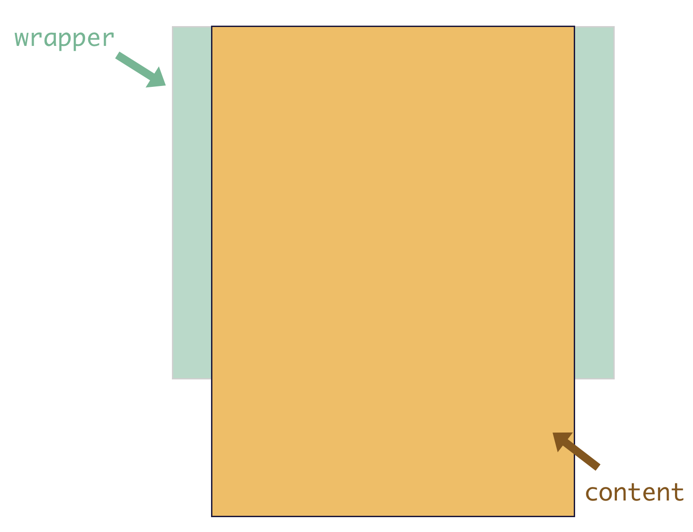

最常见的应用场景是列表滚动，我们来看一下它的`html`结构

> 此组件以不再修改，后续只对Vue@3.x做处理
> `Vue@3.x`完整版[\@wya/vc.next](https://github.com/wya-team/wya-vc.next/tree/main/src/scroller)

```
<div class="wrapper">
	<ul class="content"> 
		<li>...</li>
		<li>...</li>
		...
	</ul>
	<!-- 这里可以放一些其它的 DOM，但不会影响滚动 -->
</div>

<!-- ↓↓↓↓等价↓↓↓↓ -->
<vc-scroller tag="ul">
	<li>...</li>
	<li>...</li>
	...
</vc-scroller>

```

外层`wrapper`容器上的，滚动的部分是`content`元素。这里要注意的是，默认处理容器（`wrapper`）的第一个子元素（`content`）的滚动，其它的元素都会被忽略。

## 滚动原理

不能滚动是现象，我们得搞清楚这其中的根本原因。在这之前，我们先来看一下浏览器的滚动原理：
浏览器的滚动条大家都会遇到，当页面内容的高度超过视口高度的时候，会出现纵向滚动条；
当页面内容的宽度超过视口宽度的时候，会出现横向滚动条。
也就是当我们的视口展示不下内容的时候，会通过滚动条的方式让用户滚动屏幕看到剩余的内容。

`vc-scroller` 也是一样的原理，我们可以用一张图更直观的感受一下：



绿色部分为 wrapper，也就是父容器，它会有**固定的高度**。
黄色部分为 content，它是父容器的**第一个子元素**，它的高度会随着内容的大小而撑高。
那么，当 content 的高度不超过父容器的高度，是不能滚动的，而它一旦超过了父容器的高度，我们就可以滚动内容区了，这就是`vc-scroller`的滚动原理。